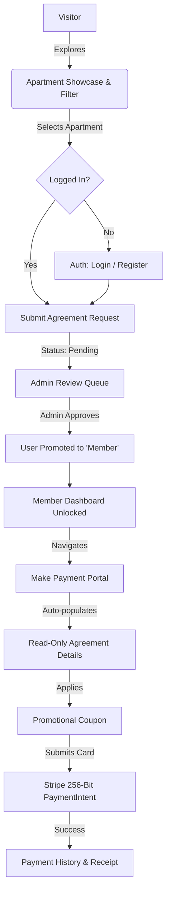

<div align="center">

# 🏢 NEXORA — Frontend
### Next-Gen Luxury Apartment Management & Resident Rental Portal

[](https://react.dev/)
[](https://vitejs.dev/)
[](https://tailwindcss.com/)
[](https://daisyui.com/)
[](https://tanstack.com/query)
[](https://stripe.com/)
[](https://www.docker.com/)
[](https://opensource.org/licenses/MIT)

<p align="center">
  <b>A responsive, feature-rich Single Page Application (SPA) designed for luxury residential properties, offering seamless apartment discovery, transparent lease workflows, secure Stripe rent payments, and real-time resident-admin messaging.</b>
</p>

[🌐 Live Demo (Client)](https://nexora-client.vercel.app) • [📡 Backend API](https://nexora-server-nine.vercel.app) • [📑 Report Bug](https://github.com/Tajuddin80/Nexora-client/issues)

</div>

---

## 📑 Table of Contents
- [🌟 Executive Summary](#-executive-summary)
- [✨ Key Features](#-key-features)
- [🛠️ Tech Stack & Architecture](#️-tech-stack--architecture)
- [📐 Application Flow & Design](#-application-flow--design)
- [💻 Getting Started](#-getting-started)
- [🐳 Docker Deployment](#-docker-deployment)
- [🚀 Deployment on Vercel](#-deployment-on-vercel)
- [🗺️ Future Engineering Roadmap](#️-future-engineering-roadmap)
- [👤 Author & Contact](#-author--contact)

---

## 🌟 Executive Summary

**Nexora** is an enterprise-grade resident and apartment management portal engineered with **React 19**, **Vite 7**, and **Tailwind CSS 4**. Designed to solve real-world property operations, Nexora bridges the gap between building administrators and tenants through automated workflows, transparent financial histories, and real-time communications.

### What Makes This Project Stand Out:
* **Production-Grade State Management**: Server-state synchronization and cache invalidation powered by **TanStack Query v5**.
* **Zero-Friction Stripe Checkout**: Fully automated agreement-linked rent payment interface with read-only security locking and coupon discounts.
* **Instant Duplex Messaging**: Real-time communication via **Socket.IO** with read receipts and media uploads.
* **Modern Aesthetic & Performance**: Bespoke DaisyUI custom light/dark luxury themes, smooth GSAP and Framer Motion micro-interactions, and sub-second page loads.
* **Containerized Infrastructure**: Production-ready multi-stage Docker build utilizing Alpine Nginx with custom SPA fallback routing and 1-year asset caching.

---

## ✨ Key Features

### 1. 👥 Role-Based Access Control (RBAC)
* **Guest / Public**: Browse luxury suites, filter by rent range, review amenities, explore neighborhood highlights with interactive Leaflet maps, and check building specs.
* **User (Applicant)**: Submit apartment lease requests with automated duplicate prevention, monitor application statuses, and track personal review queues.
* **Member (Resident)**: Access dedicated resident dashboard, view active agreement specs, inspect monthly billing schedules, pay rent online via Stripe, and review complete payment receipts.
* **Admin (Property Manager)**: Comprehensive analytical dashboard with KPI metric cards, Recharts revenue visualizations, agreement approval queues, member role downgrades, and coupon management.

### 2. 💳 Stripe Rent Payment System (`/dashboard/makepayment`)
* **Auto-Filled Lease Metadata**: Automatically retrieves approved lease specs (Floor No, Block, Apartment ID, Base Rent, Resident Email) in **read-only** mode to prevent tampering.
* **Dynamic Billing Selection**: Fetches unpaid monthly bills and pre-selects the earliest outstanding balance.
* **Live Coupon Validation**: Real-time server validation of promotional codes with instant subtotal and discount percentage calculation.
* **Encrypted Stripe Elements**: Full PCI-compliant tokenized card entry with theme-aware custom input styling for light and dark modes.
* **Automated Audit Trail**: Seamless transition from PaymentIntent creation to database receipt recording and instant redirect to the transaction history ledger.

### 3. 💬 Real-Time Resident-Admin Support Chat (`/dashboard/chat`)
* Dual-direction instant messaging powered by WebSockets (**Socket.IO**).
* Visual delivery and read indicators (`mark_read` socket events).
* Support for media uploads and rich message payloads.
* Scoped resident rooms and persistent admin support channel.

### 4. 🎨 Design & Experience Polish
* **Dynamic Theme Switcher**: Persisted light/dark luxury color palette (`mycustomlight` & `mycustomdark`).
* **Bento Grid Presentation**: Visually compelling property highlight grids with responsive image zoom effects.
* **Interactive Geo Maps**: Integrated **React Leaflet** highlighting nearby metro stations, hospitals, and parks.
* **Accessible & Secure**: ARIA labels, semantic HTML5 structure, and custom Error Boundary pages.

---

## 🛠️ Tech Stack & Architecture

| Category | Technology | Description |
| :--- | :--- | :--- |
| **Core Framework** | `React 19.1` | Latest React runtime utilizing high-performance concurrent rendering |
| **Bundler & Tooling** | `Vite 7.0` | Ultra-fast Hot Module Replacement (HMR) and optimized Rollup builds |
| **Styling & UI** | `Tailwind CSS 4.1` + `DaisyUI 5.0` | Utility-first styling with tailored luxury themes and CSS variables |
| **Server State** | `TanStack Query 5.83` | Asynchronous data fetching, background refetching, and cache invalidation |
| **Routing** | `React Router 7.6` | Client-side routing with nested layouts, guards, and error boundaries |
| **Payments** | `Stripe React SDK` | Secure client-side card element integration & PaymentIntent confirmation |
| **WebSockets** | `Socket.IO Client 4.8` | Low-latency bi-directional messaging pipeline |
| **Forms & Validation** | `React Hook Form 7.6` | Performant, uncontrolled form state management |
| **Data Visualization** | `Recharts 3.1` | Declarative SVG charting for admin KPI analytics |
| **Interactive Maps** | `React Leaflet 5.0` | Open-source mobile-friendly interactive mapping |
| **Animations** | `Framer Motion 12` & `GSAP 3` | Smooth layout transitions and scroll-triggered entrance animations |
| **Notifications** | `React Hot Toast` | Lightweight, customized toast alert system |

---

## 📐 Application Flow & Design



---

## 💻 Getting Started

### Prerequisites
* **Node.js**: `v20.x` or `v22.x` (LTS recommended)
* **npm**: `v10.x` or higher

### Local Development Setup

1. **Clone the repository**:
   ```bash
   git clone https://github.com/Tajuddin80/Nexora-client.git
   cd Nexora-client
   ```

2. **Install dependencies**:
   ```bash
   npm install
   ```

3. **Configure Environment Variables**:
   Create a `.env` file in the root directory:
   ```env
   # Backend API Base URL
   VITE_SERVER_URL=http://localhost:5000

   # Stripe Publishable Key for Rent Payments
   VITE_PAYMENT_PUBLISH_KEY=pk_test_YOUR_STRIPE_KEY

   # Cloudinary Media Configuration
   VITE_CLOUDINARY_CLOUD_NAME=your_cloud_name
   VITE_CLOUDINARY_API_KEY=your_api_key
   ```

4. **Launch development server**:
   ```bash
   npm run dev
   ```
   Open [http://localhost:5173](http://localhost:5173) in your browser.

---

## 🐳 Docker Deployment

Nexora Frontend is fully containerized using a high-performance **multi-stage Docker build** paired with an optimized **Alpine Nginx** web server.

### Build and Run with Docker:

```bash
# 1. Build the production image with optional build arguments
docker build \
  --build-arg VITE_SERVER_URL="http://localhost:5000" \
  --build-arg VITE_PAYMENT_PUBLISH_KEY="pk_test_..." \
  -t nexora-frontend .

# 2. Run container on port 80
docker run -d -p 80:80 --name nexora-client nexora-frontend
```

Access the application at [http://localhost](http://localhost).

---

## 🚀 Deployment on Vercel

The client includes a verified `vercel.json` configured with SPA rewrites so direct navigation to nested routes (`/dashboard/makepayment`, `/dashboard/my-profile`) will never throw 404s.

1. Push your code to GitHub.
2. Import the project into **[Vercel](https://vercel.com/new)**.
3. Set **Framework Preset** to `Vite`.
4. Set **Root Directory** to `Nexora-client` (if in a monorepo).
5. Add the environment variables:
   * `VITE_SERVER_URL`: `https://nexora-server-nine.vercel.app`
   * `VITE_PAYMENT_PUBLISH_KEY`: `pk_test_...`
   * `VITE_CLOUDINARY_CLOUD_NAME`: `...`
   * `VITE_CLOUDINARY_API_KEY`: `...`
6. Click **Deploy**.

---

## 🗺️ Future Engineering Roadmap

- [ ] **AI Maintenance Dispatcher**: Upload photo of apartment issue; Gemini AI auto-classifies category, urgency, and assigns maintenance personnel.
- [ ] **Automated PDF Invoices**: Client-side generation and download of branded tax invoices for completed rent payments.
- [ ] **Virtual 3D Room Tours**: WebGL/Three.js interactive 360-degree walkthroughs of available luxury suites.
- [ ] **Push Notifications via Web Push API**: Browser alerts for rent dues, lease approvals, and community announcements.
- [ ] **End-to-End Test Suite**: Comprehensive testing pipeline implemented with Playwright and Vitest.

---

## 👤 Author & Contact

**Taj Uddin**  
Full-Stack Software Engineer  
* 📧 Email: [tajuddin.cse.dev@gmail.com](mailto:tajuddin.cse.dev@gmail.com)  
* 🐙 GitHub: [@Tajuddin80](https://github.com/Tajuddin80)  
* 💼 LinkedIn: [Connect on LinkedIn](https://www.linkedin.com/in/tajuddin80/)

---

<div align="center">
  <sub>Built with precision and care for the modern web. Licensed under the MIT License.</sub>
</div>
